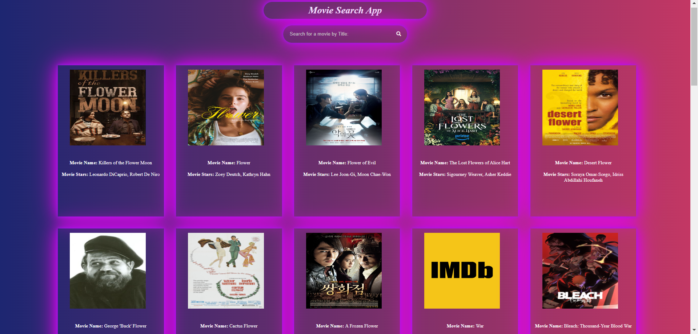

# Movies App Project
Welcome to the Search Movies App Project, this is a simple Movies app using API integration and DOM manipulation by **JavaScript**, **HTML**, and **CSS** that Represent popular Movies.

---
## Description 
The project is implemented with HTML, CSS, and JavaScript. The HTML file (`index.html`) sets up the structure of the Movies app, the CSS file (`style.css`) provides styling, and the JavaScript file (`main.js`) implements the app's functionality that ensures a comprehensive and user-friendly experience such as: 

1. The user can see the movies without searching.
2. Users are able to search for movies by title.
3. The user can see a list of movie results based on his search with details.
4. A responsive design that looks good on desktop and mobile devices.
5. Remember the search history for the user.

 
The Search history is stored in **_local storage_**, ensuring they remain accessible even if you close the browser window.

you should be familiar with the following **_technologies_**:
1. HTML
2. CSS
3. JavaScript | DOM Manipulations for manipulation and local storage to store your Search history.
4. API Integration 

---
## Live Demo
You can check out the live demo of the project on <a href="https://qamarsharef27.github.io/Movies/">Live Demo</a>.

---
## Get the Project Locally
To get the project on your local machine, follow these steps:

1. Open a command-line interface **(Terminal)**.
1. **Clone the Repository:** Clone this repository to your local machine using the following command: git clone <https://github.com.qamarSharef27/Movies>
2. **Navigate to the Project Directory:** Change your working directory to the project folder: cd Movies
3. **Run the Application:** Open the `index.html` file in your preferred web browser to interact with the app locally, You can either double-click the index.html file in your file explorer, or you can run the following command in the terminal: open index.html

---

